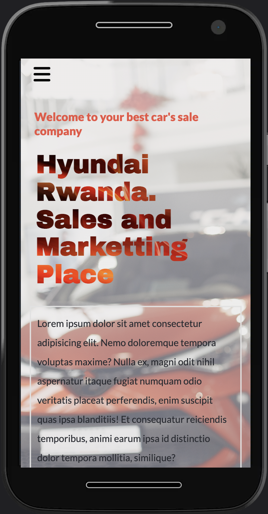

# HYUNDAI SALES AND CARS RENTAL

> Capstone Project desktop and mobile versions.

## Screensot

## Built With

- HTML
- CSS
- JS

## Getting Started

Simple website design made by the use of HTML, CSS and Javascript for completion of my module one.

## Live Demo

[Live Demo](https://kabika681.github.io/HyundaiBest/index.html)

## Video Description

Check this [Video](https://www.loom.com/share/8edb4922721b4152b97238a2bf260d1c) for demo presentation of the page.

## Authors

👤 **PASCAL KABIKA MP.**

- GitHub: [KABIKA681](https://github.com/KABIKA681?tab=overview&from=2021-12-01&to=2021-12-31)
- LinkedIn: (https://www.linkedin.com/in/pascal-kabika-443061220/)

## 🤝 Contributing

Contributions, issues, and feature requests are welcome!

Feel free to check the [issues page](../../issues/).

## Show your support

Give a ⭐️ if you like this project!

## Acknowledgments

- The [design](https://www.behance.net/gallery/29845175/CC-Global-Summit-2015) is originally created by [@Cindy Shin](https://www.behance.net/adagio07) with an open [license](https://creativecommons.org/licenses/by-nc/4.0/) of NonCommercial use. Some modifications has been made to fit the needed requirment of the project. This project is designed as an assignment for my school and not for commercial use.

## 📝 License

This project is [MIT](./LICENSE) licensed.
